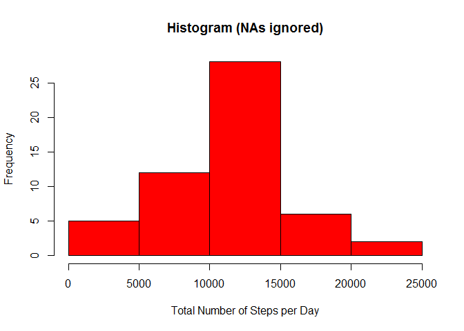
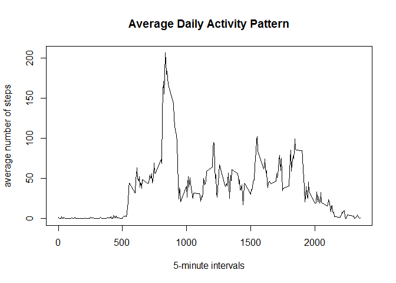
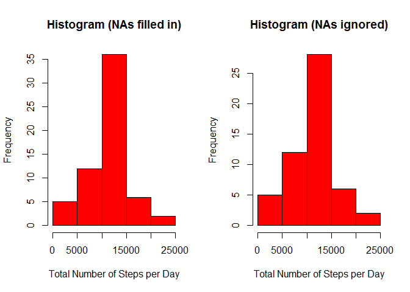

# Activity Monitoring Data

In this report, we analyze data from a personal activity monitoring device. Data is collected at 5 minute intervals throughout the day. The dataset consists of two months of data from an unknown individual collected during the months of October and November, 2012 and include the number of steps taken in 5 minute intervals each day.

## Loading the Data

First we unzip the data and load it into R

```r
unzip("activity.zip")
activity<-read.csv("activity.csv")
```

## Total Number of Steps Per Day

We are interested in the mean total number of steps taken per day.  First, we transform our data frame containing days and 5-minute intervals to a daily data frame with the total number of steps taken per day using the R function aggregate. We ignore missing values in the dataset.

```r
activityDaily<-aggregate(steps~date, activity, sum, na.rm=TRUE)
```

The new data frame has two columns: the date and the total steps taken that day.

```r
head(activityDaily)
```

```
##         date steps
## 1 2012-10-02   126
## 2 2012-10-03 11352
## 3 2012-10-04 12116
## 4 2012-10-05 13294
## 5 2012-10-06 15420
## 6 2012-10-07 11015
```

Let's make a histogram of the total number of steps taken each day:

```r
hist(activityDaily$steps,main="Histogram (NAs ignored)",xlab="Total Number of Steps per Day", col="red")
```

\

Now that we have the total number of steps for each day, let's calculate some summary statistics.

```r
summary(activityDaily$steps,na.rm=TRUE)
```

```
##    Min. 1st Qu.  Median    Mean 3rd Qu.    Max. 
##      41    8841   10760   10770   13290   21190
```
The mean number of steps per day is 10766 and the median number of steps is 10765.

## Average Daily Activity Pattern

We are interested in analyzing the average daily activity pattern. We make a time series plot of the 5-minute interval (x-axis) and the average number of steps taken, averaged across all days (y-axis). First we create a data frame aggregated by time intervals using the average number of steps. Again, we ignore missing values.

```r
activityInterval<-aggregate(steps ~ interval, activity, mean, na.rm=TRUE)
plot(activityInterval$interval,activityInterval$steps,type="l",xlab="5-minute intervals",ylab="average number of steps",main="Average Daily Activity Pattern")
```

\

Which 5-minute interval, on average across all the days in the dataset, contains the maximum number of steps? Let's find out:

```r
maxelem <- which.max(activityInterval$steps)
activityInterval[maxelem, ]
```

```
##     interval    steps
## 104      835 206.1698
```
The 5-minute interval 835 contains the maximum number steps which is equal to 206.1698.

## Imputing Missing Values
So far we have ignored any missing values. The presence of missing values may introduce bias into some calculations or summaries of the data. First, let's calculate how many missing values we have in our original dataset. 


```r
sum(is.na(activity))
```

```
## [1] 2304
```
In total there are 2304 missing values in the original dataset. 
Instead of ignoring these missing values, let's fill in all of the missing values in the dataset with the mean for that 5-minute interval.


```r
activityNew<-activity
activityNew[is.na(activityNew$steps), "steps"] <- tapply(activityNew$steps, activityNew$interval, mean,na.rm=TRUE)
```

We now create a daily data frame again with the total number of steps per day and plot the 
histogram with the missing values filled in. We compare this histogram with the histogram for the original data where we ignored missing values.


```r
activityNewDaily<-aggregate(steps~date, activityNew, sum)
par(mfrow = c(1, 2))
hist(activityNewDaily$steps,main="Histogram (NAs filled in)",xlab="Total Number of Steps per Day", col="red")
hist(activityDaily$steps,main="Histogram (NAs ignored)",xlab="Total Number of Steps per Day", col="red")
```

\

The histogram is only slightly different from the previous one where we ignored the missing values. Let's look at some summary statistics:

```r
summary(activityNewDaily$steps)
```

```
##    Min. 1st Qu.  Median    Mean 3rd Qu.    Max. 
##      41    9819   10770   10770   12810   21190
```

Next, we calculate the mean and median number of steps.

```r
mean(activityNewDaily$steps)
```

```
## [1] 10766.19
```

```r
median(activityNewDaily$steps)
```

```
## [1] 10766.19
```
These numbers are very similar to the one from the previous analysis where we ignored the missing values. In fact, the mean is the same but the median is slightly different.

## Differences in activity patterns between weekdays and weekends

Finally, we analyze if there are any differences in activity patterns between weekdays and weekends. We use the dataset with the filled-in missing values. In order to do the analysis, we create a new factor variable in the dataset with two levels "weekday" and "weekend" indicating whether a given date is a weekday or weekend day. We use the R function weekdays().


```r
weekdays1 <- c('Monday', 'Tuesday', 'Wednesday', 'Thursday', 'Friday')
activityNew$daytype <- factor((weekdays(as.Date(activityNew$date)) %in% weekdays1), 
                   levels=c(FALSE, TRUE), labels=c('weekend', 'weekday')) 
```

Now that we have created a factor variable indicating weekdays and weekends, we can use the lattice plotting system to create a panel plot containing a time series plot of the 5-minute interval (x-axis) and the average number of steps taken, averaged across all weekday days or weekend days (y-axis). 


```r
library(lattice)
activityNewInterval<-aggregate(steps ~ interval + daytype, activityNew, mean)
xyplot(steps~interval|daytype,
       data=activityNewInterval,
       type="l",
       ylab="Number of steps",
       xlab="Interval",
       layout=c(1,2))
```

\
